# DawgPath Data Pipeline Architecture Plan: Dagster Runner & GCS Artifact Delivery

Last updated: 2026-09-09

## Executive Summary

This architecture plan details the transition of the DawgPath ETL pipeline from un-orchestrated Python scripts to a dedicated **Dagster** orchestration model hosted on UW-IT ACA Google Kubernetes Engine (GKE) infrastructure, with versioned artifact delivery via Google Cloud Storage (GCS).

---

## Architecture Principles

1. **Dedicated Orchestration Model (Dagster):**
   - Use open-source Dagster as the core engine for scheduling, dependency tracking, retries, backfills, execution logging, and asset lineage.
   - Run Dagster webserver, daemon, and worker pods within the namespace/cluster.

2. **Software-Defined Assets:**
   - Model ETL job outputs as Dagster `@asset` definitions divided into three tiers:
     - **Source Refreshes:** EDW/SWS tables (`course`, `curriculum`, `prereq`, `major`, `sr_major`, `registration`, `regis_major`, `transcript`, `sws_course`).
     - **Derived Assets:** Graphs and statistical aggregations (`course_prereq_graphs`, `curric_prereq_graphs`, `curric_prereq_lists`, `concurrent_courses`, `student_model`, `common_course_major`, `common_major_for_course`, `concurrent_courses_major`, `course_gpa_distro`, `major_dec_grade_distro`).
     - **Published Artifacts:** Deliverable JSON and pickle payloads (`course_export_json`, `curric_export_json`, `major_export_json`, `course_prereq_pickle`, `prereq_pickle`).

3. **Object Storage Artifact Delivery:**
   - Materialize published artifacts into Google Cloud Storage buckets (`gs://uw-dawgpath-pipeline-artifacts-{env}/`).
   - Write artifacts under run IDs / timestamps (e.g. `artifacts/runs/{run_id}/course_data.json`) and update an atomic `manifest.json` pointer (`artifacts/latest/manifest.json`).
   - Consuming applications (e.g. DawgPath / Prereq Map) read published artifacts via HTTPS / GCS bucket URLs or manifest pointers rather than committing generated files into app repositories.

4. **Safety & Transaction Boundaries:**
   - Database updates execute via single-transaction `_atomic_replace` in `DataJob`.
   - Long-running multi-quarter jobs (`FetchRegistrationData`, `BuildConcurrentCourses`) write to isolated staging tables before atomic pointer swaps.

5. **UW SSO & Access Boundary:**
   - Dagster webserver UI and GraphQL API remain internal to the cluster/namespace.
   - User browser access and manual run triggers are gated through the SAML-authenticated Django gateway app (`dawgpath_pipeline_admin`) using `uw-django-saml2`.
   - Credentials, DB connections, and SAML certs are injected dynamically via Vault and Kubernetes `ExternalSecret` resources.

---

## Data Pipeline Graph & Asset Lineage

```mermaid
graph TD
    subgraph Tier 1: Source Refreshes
        A1[FetchCourseData]
        A2[FetchCurricData]
        A3[FetchPrereqData]
        A4[FetchMajorData]
        A5[FetchSRMajorData]
        A6[FetchRegistrationData]
        A7[FetchRegisMajorData]
        A8[FetchTranscriptData]
        A9[FetchSWSCourseData]
    end

    subgraph Tier 2: Derived Local Assets
        B1[BuildCoursePrereqGraphs]
        B2[BuildCurricPrereqLists]
        B3[BuildCurricPrereqGraphs]
        B4[BuildConcurrentCourses]
        B5[PrepareStudentModel]
        B6[BuildCommonMajorForCourse]
        B7[BuildCommonCourseMajor]
        B8[BuildConcurrentCoursesMajor]
        B9[BuildCourseGPADistro]
        B10[BuildMajorDecGradeDistro]
    end

    subgraph Tier 3: Published Artifacts & GCS
        C1[ExportCourseData JSON]
        C2[ExportCurricData JSON]
        C3[ExportMajorData JSON]
        C4[ExportCoursePrereqData Pickle]
        C5[ExportPrereqData Pickle]
    end

    A1 --> B1
    A3 --> B1
    A1 --> B2
    A2 --> B2
    A3 --> B2
    A1 --> B3
    A2 --> B3
    A3 --> B3
    A6 --> B4
    A7 --> B5
    A6 --> B6
    B5 --> B6
    A1 --> B7
    A6 --> B7
    A7 --> B7
    A6 --> B8
    A7 --> B8
    A6 --> B9
    A7 --> B10
    A8 --> B10

    A1 --> A9
    A6 --> A9

    B1 --> C1
    B4 --> C1
    B9 --> C1
    A9 --> C1

    B2 --> C2
    B3 --> C2

    A4 --> C3
    A5 --> C3
    B7 --> C3
    B10 --> C3

    A1 --> C4
    A3 --> C5
```

---

## Worker Pod Sizing Tiers & Split Schedules

To prevent long-running jobs from consuming excessive cloud resources or holding EDW connections open unnecessarily, the pipeline execution is split across three isolated worker tiers and decoupled schedules without modifying internal job algorithms.

### 1. Worker Pod Sizing Tiers (Kubernetes)

Each asset wrapper is assigned a Dagster Kubernetes tag (`dagster-k8s/config`), allowing GKE to launch dedicated worker pods sized appropriately for that specific task:

| Worker Tier | Resource Profile | Assigned Jobs |
|---|---|---|
| **Tier 1: Standard / Light** | `requests: {cpu: 500m, memory: 512Mi}` `limits: {cpu: 1000m, memory: 2Gi}` | `FetchCurricData`, `FetchSRMajorData`, `FetchMajorData`, `FetchCourseData`, `FetchPrereqData`, `FetchSWSCourseData`, `ExportCourseData`, `ExportCurricData`, `ExportMajorData`, `ExportCoursePrereqData`, `ExportPrereqData`. |
| **Tier 2: Medium Data Aggregation** | `requests: {cpu: 2, memory: 4Gi}` `limits: {cpu: 4, memory: 8Gi}` | `FetchRegisMajorData`, `FetchTranscriptData`, `BuildCommonCourseMajor`, `BuildCommonMajorForCourse`, `BuildConcurrentCoursesMajor`, `BuildCourseGPADistro`, `BuildMajorDecGradeDistro`, `BuildCurricPrereqLists`. |
| **Tier 3: High Compute / Multiprocessing** | `requests: {cpu: 4, memory: 8Gi}` `limits: {cpu: 8, memory: 16Gi}` | `FetchRegistrationData` (10-year EDW fetch), `BuildCoursePrereqGraphs` (Multiprocessing graph building), `BuildCurricPrereqGraphs`, `BuildConcurrentCourses` (8-quarter co-registration matrix), `PrepareStudentModel` (Multiprocessing system-key mapping). |

*Note: Tier 3 worker pods spin up dynamically only when heavy jobs execute and automatically terminate immediately upon completion.*

### 2. Decoupled Schedules & Execution Groups

Instead of executing all 25 jobs in a single monolithic run, execution is partitioned into three independent schedule groups:

1. **Daily Catalog Refresh Schedule (Fast & Light):**
   - **Jobs:** `FetchCourseData`, `FetchCurricData`, `FetchMajorData`, `FetchPrereqData`, `FetchSRMajorData`, `FetchSWSCourseData`.
   - **Frequency:** Every night at 1:00 AM PST.
   - **Duration:** ~1 to 3 minutes.
2. **Weekly / Term Historical Aggregation Schedule (Heavy):**
   - **Jobs:** `FetchRegistrationData`, `FetchRegisMajorData`, `FetchTranscriptData`, `PrepareStudentModel`, `BuildCoursePrereqGraphs`, `BuildCurricPrereqGraphs`, `BuildCurricPrereqLists`, `BuildConcurrentCourses`, `BuildCommonCourseMajor`, `BuildCommonMajorForCourse`, `BuildConcurrentCoursesMajor`, `BuildCourseGPADistro`, `BuildMajorDecGradeDistro`.
   - **Frequency:** Sunday at 2:00 AM PST (or manually triggered on term rollover).
3. **Artifact Materialization & Publishing:**
   - **Jobs:** `ExportCourseData`, `ExportCurricData`, `ExportMajorData`, `ExportCoursePrereqData`, `ExportPrereqData`.
   - **Trigger:** Automatic Dagster asset sensor triggering whenever upstream derived assets complete or update.

---

## Deployment & Hosting Strategy

- **Repository Structure:**
  - Source repo: `dawgpath-data-pipeline`
  - Code package: `dawgpath_data_pipeline/orchestration/` containing Dagster definitions (`assets.py`, `jobs.py`, `schedules.py`, `resources.py`).
- **Container Images:**
  - `dawgpath-pipeline-runner`: Image containing Python dependencies (`dagster`, `dagster-postgres`, `dagster-gcp`, `sqlalchemy`, `pandas`, `pymssql`).
  - `dawgpath-pipeline-admin`: Image built from `django-container` base for the SAML web gateway.
- **Flux Deployment Configuration (`gcp-flux-dev` / `gcp-flux-prod`):**
  - **Dagster Webserver:** StatefulSet/Deployment exposing internal service on port 3000.
  - **Dagster Daemon:** Deployment executing scheduled triggers, sensors, and run queue dispatch.
  - **Postgres DB:** Cloud SQL or cluster Postgres instance storing Dagster run history, step events, and asset metadata.
  - **GCS Bucket:** `gs://uw-dawgpath-pipeline-artifacts-{env}` for asset storage.

---

## Implementation Roadmap (Steps 3 - 9)

- **Step 3:** Define Dagster code module and wrapper assets (`dawgpath_data_pipeline/orchestration/`).
- **Step 4:** Implement GCS I/O Manager and versioned manifest generator.
- **Step 5:** Add staging table mechanics for long-running multi-quarter jobs.
- **Step 6:** Configure operational metadata logging and privacy rules (`MINIMUM_DATA_COUNT = 8`).
- **Step 7:** Add local Dagster CLI/UI runner and Docker/Kubernetes specs.
- **Step 8:** Configure optional Django SAML admin gateway (`dawgpath_pipeline_admin`).
- **Step 9:** Secure authentication boundary and ExternalSecret configurations.
